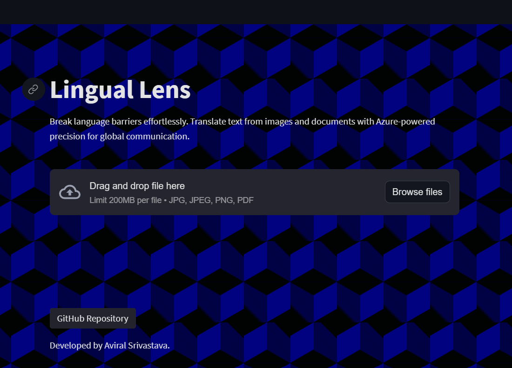
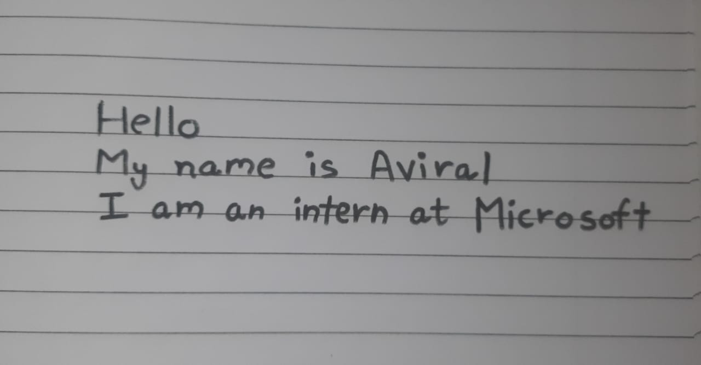
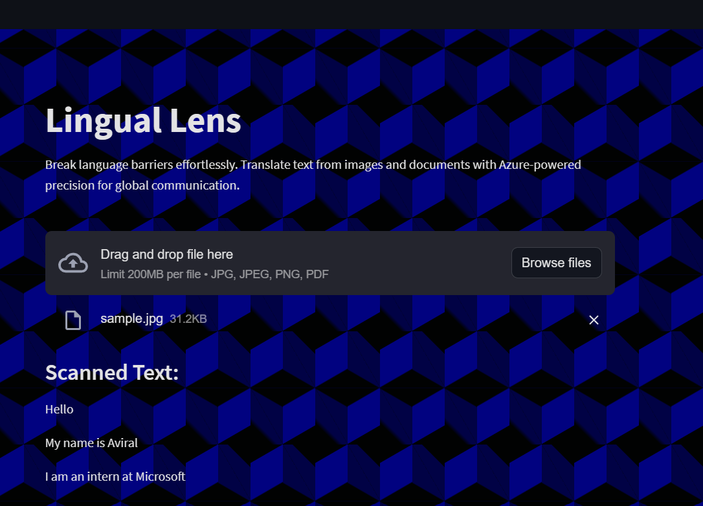
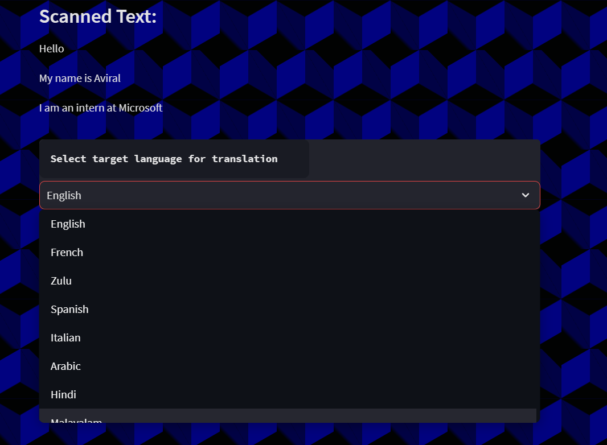
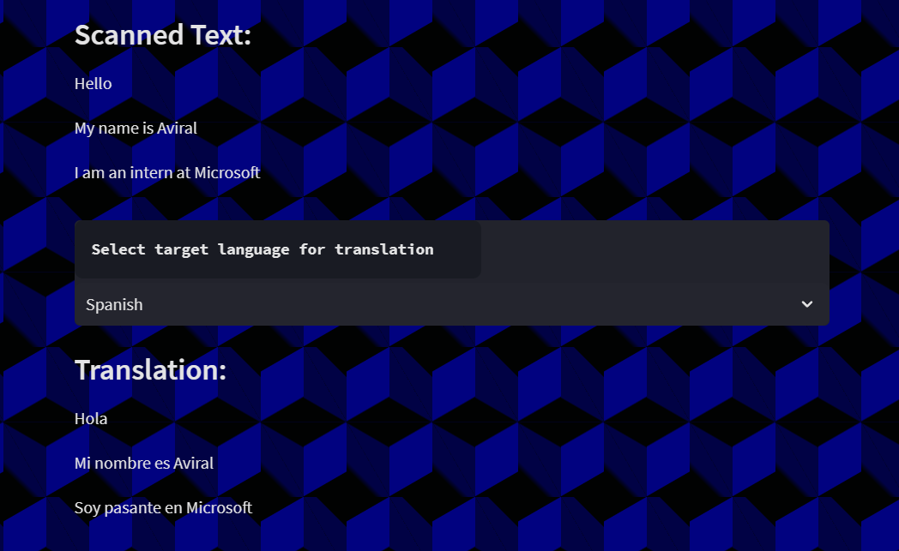
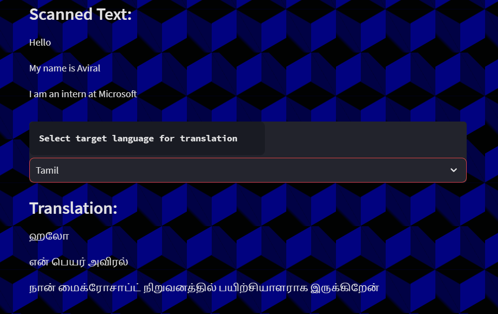
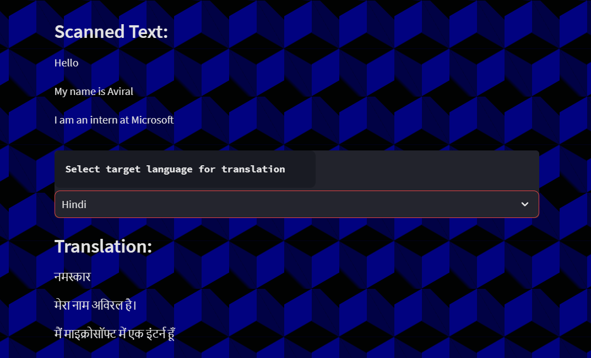
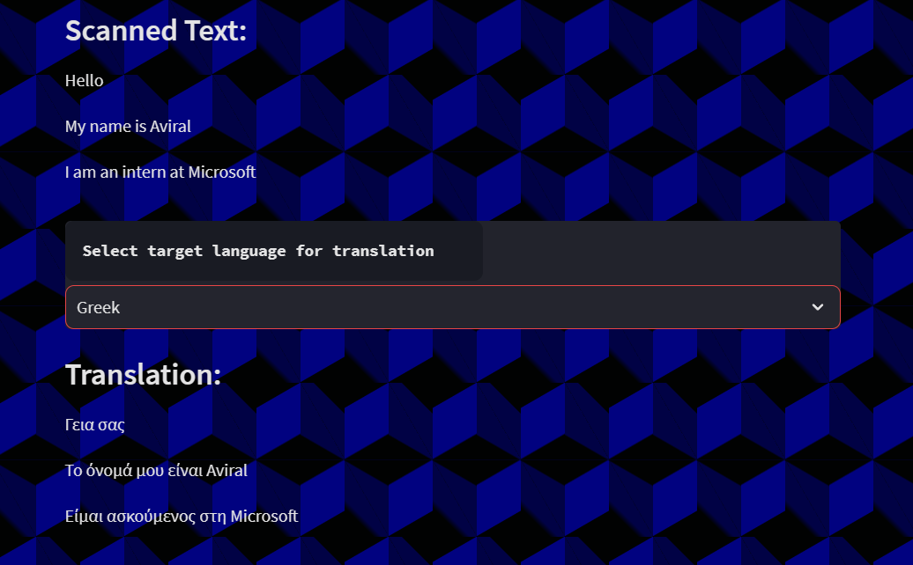

<h1 align="center">The Lingual Lens Project</h1>

[](https://github.com/meaviral17/LingualLens-Project/issues)
[](https://github.com/meaviral17/LingualLens-Project)
[](https://opensource.org/licenses/MIT)
[](https://github.com/meaviral17/LingualLens-Project)

## Project Description

LingualLens is a revolutionary project addressing the universal challenge of language barriers, leveraging advanced technology such as Azure AI Computer Vision and Azure AI Translator. This web application extracts and translates text from images and documents, empowering individuals in marginalized communities to communicate effortlessly in their preferred language.

Key features include multilingual text recognition for various image formats, seamless integration with Azure App Service for scalable deployment, and a user-friendly interface crafted with Streamlit. LingualLens transcends language translation, fostering global collaboration and educational empowerment. More than a tool, LingulaLens is a catalyst for positive change, breaking down language barriers and fostering a more interconnected world.

## Project Details
---

## Table of Contents
* [Tech Stack](#Tech-Stack)
* [Key Features](#Key-Features)
* [Explaination of Azure Services Used](#Explaination-of-Azure-Services-Used)
* [Clone and run this project](#Clone-and-run-this-project)
* [Steps to use LingualLens](#Steps-to-use-LingualLens)

---
## Tech Stack

- **Frontend:**
  - Streamlit (Python library for creating interactive web applications)
- **Backend:**
  - Azure App Service (Cloud-based platform for deploying and managing web applications)
- **OCR and Translation Services:**
  - Azure AI Document Intelligence (for detecting text from images and documents)
  - Azure AI Translator (for translating recognised text into multiple languages)
- **Development Environment:**
  - Visual Studio Code (Code editor for efficient development)
- **Cloud Management:**
  - Microsoft Azure Portal (for centralized management, configuration, and monitoring)
- **Programming Language:**
  - Python (utilized for backend development and integration with Streamlit)
- **Version Control:**
  - Git (for version control and collaborative development)
- **Dependency Management:**
  - Python Pip (for managing Python package dependencies)
---
## Key Features

1. **Multilingual Text Recognition:** Utilize cutting-edge OCR technology to accurately recognize text from images and documents in various formats, including JPEG, PNG, and PDF.
2. **Translation Diversity:** Seamlessly translate retrieved text into over 50+ languages, promoting inclusive communication for individuals in diverse communities.
3. **User-Friendly Interface:** Experience a smooth and intuitive interface designed for easy image uploads and document processing, ensuring accessibility for users of all technical backgrounds.
4. **Streamlined Deployment:** LinguaLens is deployed effortlessly with Azure App Service, providing a scalable and reliable platform for managing the web application.
5. **Azure Integration:** Leverage the power of Azure AI Document Intelligence and Azure AI Translator for robust text detection, translation, and seamless integration with the LinguaLens application.
6. **Global Collaboration:** Foster collaboration in a corporate setting by enabling smooth communication between colleagues who speak different languages.
7. **Educational Empowerment:** Empower individuals from marginalized communities with access to information in their native language, potentially opening doors to educational opportunities and knowledge.
---
## Explaination of Azure Services Used

### 1. Azure AI Translator
- The Translator service plays a pivotal role in making the application globally accessible by translating extracted English text into multiple languages. This functionality eradicates language barriers, fostering effective communication and understanding among users with diverse language preferences.

- The service operates by sending the extracted text, translating each line sequentially from English to the user's preferred language. The translated output, exemplified in JSON format, demonstrates the service's versatility.

### 2. Azure AI Document Intelligence (Computer Vision)
- Incorporated for character extraction from images (PNG, JPEG), and PDFs, Azure AI Document Intelligence (Computer Vision) excels in extracting text from diverse formats. Its advanced capabilities make it a vital component for processing scanned documents or images, with seamless integration into applications.

- The Optical Character Recognition (OCR) feature within the Computer Vision Studio facilitates the extraction of intricate written text from various formats. The resulting text, exemplified in JSON format, showcases the service's proficiency in handling complex document structures.

- Post-extraction, each line of text undergoes translation through the Azure Translator API, enhancing the application's multilingual functionality.

### 3. Azure App Service
- Functioning as the hosting platform for the application's user interface, Azure App Service streamlines deployment and ensures scalability. This service simplifies the development process by eliminating the need to manage underlying infrastructure, providing a reliable environment for Streamlit-based applications.

- As shown in the screenshot below, we can see the App Service "linguallens" we have created to deploy our project using Azure App Service in the East Asia sector. It is configured to a B1 App Service Plan.


- Attached below is the configured Linux plan "ASP-azureintern-ab84" for our App Service Deployment.


- The deployment process involves pushing the entire code, covering text recognition, translations, and the Streamlit web application, to GitHub. Upon successful code push, the GitHub project URL is provided to the Azure App service, triggering an automatic deployment process.
- The workflow run of the project deployment is attached below:


### 4. Microsoft Azure Portal
- Serves as the central hub for managing and monitoring the deployed application. The portal provides a comprehensive view of the application's status, including deployment details, making it a vital tool for overseeing the entire project.
  


- Given below is the resource group "azureintern", we have created to keep track of all Azure resources created for this project, and track their performance with a single dashboard interface.
  


### 5. Visual Studio Code
- Used as the primary integrated development environment (IDE) for coding and managing the project. Visual Studio Code streamlines the development process, offering a robust platform for coding, debugging, and version control.
  


---
## Clone and run this project
1. Clone this repository:
```bash
git clone https://github.com/yourusername/your-repo.git
cd your-repo
```
2. Install the dependencies using pip command:
```bash
pip install -r requirements.txt
```
3. Run the Streamlit app script :
```bash
streamlit run main_script.py
```
---

## Steps to use LingualLens
1. Commence the process by initiating the upload of any image or PDF through the **Browse files** button.

---
-> The WebApp also contains a side menu offering various functionalities like Rerun, Record screencast, Print and Theme-related settings:


---
2. Following the selection of the file, the **Azure AI Document Intelligence** engages in processing, culminating in the presentation of the extracted text. Let's take the file given below as input.


---
3. Scrutinize the extracted text obtained from the provided image:


---
4. Proceed by navigating downwards to opt for the preferred language for translation.
5. Upon language selection, the **Azure AI Translator API** undertakes the translation process, showcasing the translated text underneath.


---
6. Observe the translated text in the chosen languages, illustrated here with Hindi, Tamil, Spanish, and Greek options:
---
**a. Spanish**


---
**b. Tamil**


---
**c. Hindi**


---
**d. Greek**


---
